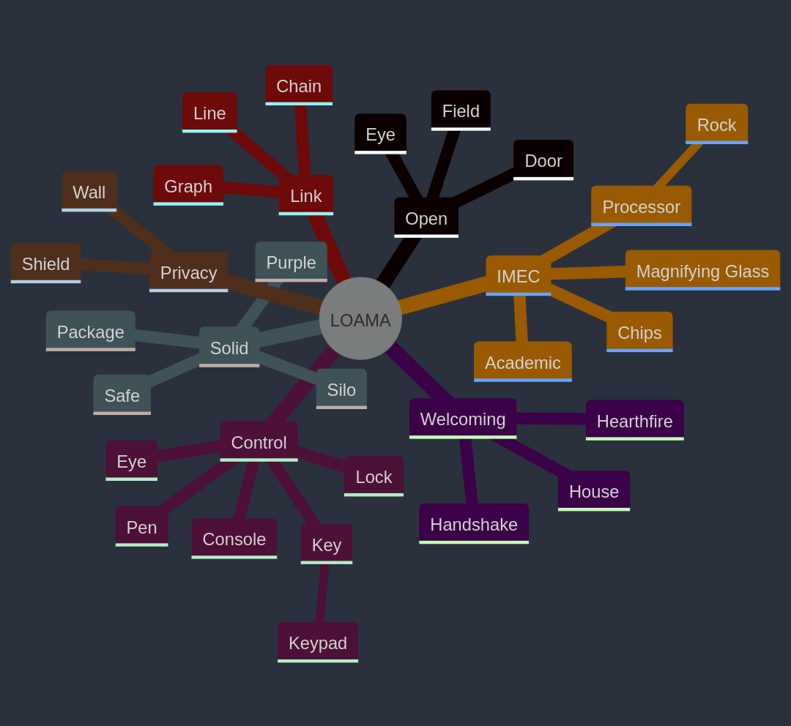

# Branding

For the project, we made an appropriate branding that is based on the [SOLID logo](https://solidproject.org). We did this by using several branding techniques commonly used to create a brand from scratch.

## 1. Personifying the product
In order to differentiate our brand from Solid, we trying personifying our product by asking some thought-provoking questions:
- If our product was a person, what would they wear to a party, how would they act on the party and what would be their favorite music?
- If we need to associate our product with a season, what would this be?

## 2. Term association
In order to find out which things or terms we associated with our product, we created a mindmap with terms that we associate with our product and objects we associate with those terms.

This gave us more insight in what we could use as a basis for naming our product. 

## 3. Name
The name LOAMA is an acrynom:
> **L**inked **O**pen **A**ccess **M**anagement **A**pp 

It's a technical way to describe our project, but the acronym *(Loama)* was an unexpected inspiration for our brand, as it became a basis for which we build our brand, crest and color palette.

## 4. Typography & Color Usage
During the design process, we research and define a typography & color palette in order to have a consistent look & feel through the project. These elements were re-used within the design prototype, presentations, live demos and documentation.

For our font, we've decided to use a monospace font *([Jetbrains Mono](https://www.jetbrains.com/lp/mono/))* for headers, wordmark or highlight text. This allowed us to give of an technological feeling and worked great in creating a contrast with our sans-serif font.

Our standard / sans-serif font of choice is the [Raleyway font](https://www.theleagueofmoveabletype.com/raleway), as it already has a usage: It's the main font style of the Solid project. Because of this, our project has a strong correlation to Solid, but can differentiate itself by using the mono font.